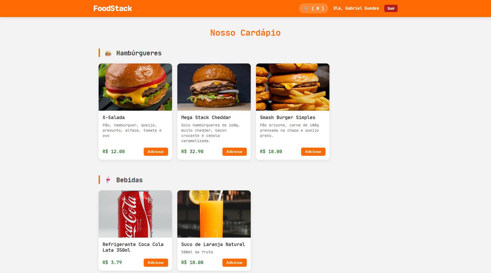
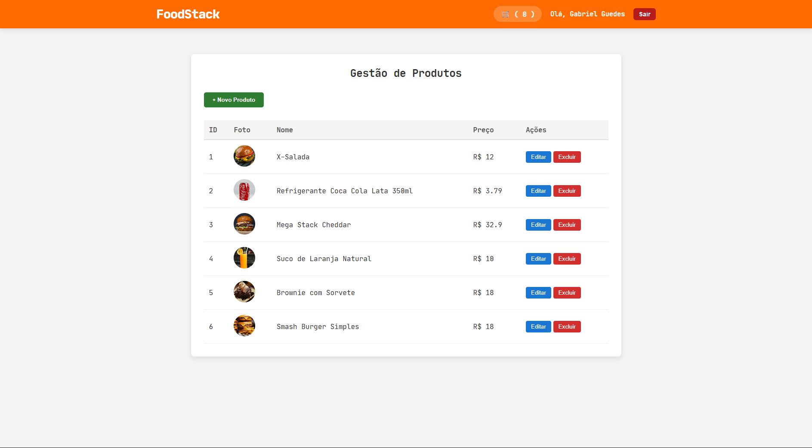

# 🍔 FoodStack - Sistema de Delivery Full-Stack


## 💻 Sobre o Projeto

O **FoodStack** é uma aplicação completa de delivery de comida desenvolvida para estudar a integração profunda entre um Back-end robusto em **Java/Spring Boot** e um Front-end moderno em **Angular**.

O sistema simula o fluxo real de um restaurante:
1.  **Cliente:** Navega no cardápio, adiciona itens ao carrinho e faz o pedido.
2.  **Cozinha (Admin):** Recebe o pedido em tempo real, altera o status (Pendente -> Preparo -> Entrega) e gerencia o cardápio.

---

## 📸 Screenshots

### Visão do Cliente (Cardápio e Carrinho)


### Visão da Cozinha (Gestão de Pedidos)


---

## 🛠 Tecnologias Utilizadas

### Back-end (API REST)
* **Java 17** & **Spring Boot 3**
* **Spring Security + JWT:** Autenticação e Autorização baseada em Roles (ADMIN vs CLIENT).
* **Spring Data JPA:** Persistência de dados.
* **PostgreSQL:** Banco de dados relacional.
* **Maven:** Gerenciamento de dependências.

### Front-end (SPA)
* **Angular 17+:** Uso de **Standalone Components** (sem NgModules).
* **RxJS:** Gerenciamento de estado reativo e manipulação de fluxos de dados.
* **TypeScript:** Tipagem estática para maior segurança.
* **CSS3:** Layout responsivo com Flexbox e Grid.

---

## 🧠 Principais Desafios e Aprendizados

Este projeto foi um laboratório de estudos focado em resolver problemas reais de integração Full-Stack:

### 1. Segurança e CORS (O Desafio do PATCH)
Um dos maiores desafios foi configurar o **Spring Security** para permitir requisições `PATCH` vindas de uma origem diferente (Angular).
* **Solução:** Configuração explícita de `CorsConfigurationSource` no Spring, liberando métodos HTTP específicos (`GET`, `POST`, `PUT`, `DELETE`, `PATCH`) e cabeçalhos para a origem do Front-end.

### 2. Tratamento de Concorrência (UX)
Ao alterar o status de um pedido, havia uma latência entre a gravação no banco e a atualização da lista na tela, causando "falsos positivos".
* **Solução:** Implementação de **Atualização Otimista** (Optimistic UI) no Front-end. O Angular atualiza a interface visualmente de imediato para dar feedback instantâneo ao usuário, enquanto aguarda a confirmação e re-sincronização com o servidor em background.

### 3. Enumeração e Desserialização
O mapeamento entre `Enums` do Java (ex: `LANCHE`, `BEBIDA`) e o JSON do Front-end exigiu tratamento cuidadoso de *Case Sensitivity* e ordenação personalizada das categorias no Front-end para garantir uma experiência de usuário lógica (Lanches antes de Bebidas).

---

## 🚀 Como Executar

### Pré-requisitos
* Java 17 JDK
* Node.js & NPM
* PostgreSQL

### 1. Back-end
1.  Clone o repositório.
2.  Configure o banco de dados no arquivo `src/main/resources/application.properties`:
    ```properties
    spring.datasource.url=jdbc:postgresql://localhost:5432/foodstack_db
    spring.datasource.username=seu_usuario
    spring.datasource.password=sua_senha
    ```
3.  Execute a aplicação Spring Boot.

### 2. Front-end
1.  Navegue até a pasta do frontend.
2.  Instale as dependências:
    ```bash
    npm install
    ```
3.  Inicie o servidor de desenvolvimento:
    ```bash
    ng serve
    ```
4.  Acesse `http://localhost:4200`.

---

## 📂 Estrutura do Banco de Dados

O sistema utiliza tabelas relacionais principais:
* `tb_usuarios`: Credenciais e Roles.
* `tb_produtos`: Itens do cardápio com categorias.
* `tb_pedidos`: Cabeçalho do pedido (Status, Cliente, Data).
* `tb_itens_pedido`: Relacionamento N:N entre Pedidos e Produtos.

---

## 👨‍💻 Autor

**Gabriel Guedes**

Desenvolvido como projeto de estudo para aprofundamento em arquitetura Full-Stack Java e Angular.

[]((http://linkedin.com/in/gabriel-guedes-de-oliveira-dev))